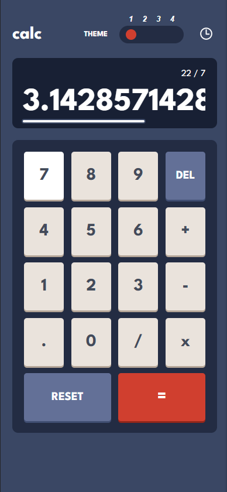
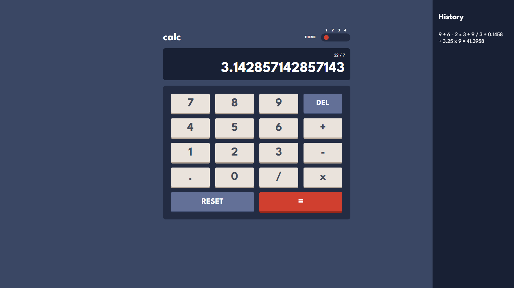
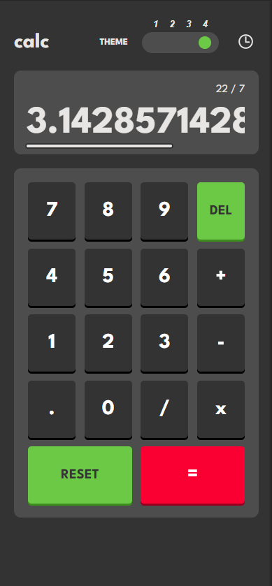
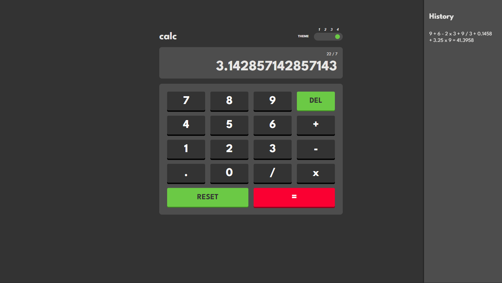

# Frontend Mentor - Calculator app solution

This is a solution to the [Calculator app challenge on Frontend Mentor](https://www.frontendmentor.io/challenges/calculator-app-9lteq5N29). Frontend Mentor challenges help you improve your coding skills by building realistic projects. 

## Table of contents

- [Overview](#overview)
  - [The challenge](#the-challenge)
  - [Screenshot Mobile](#screenshot-mobile)
  - [Screenshot Desktop](#screenshot-desktop)
  - [Screenshot Mobile Dark](#screenshot-mobile-dark)
  - [Screenshot Desktop Dark](#screenshot-desktop-dark)
  - [Links](#links)
- [My process](#my-process)
  - [Built with](#built-with)
  - [What I learned](#what-i-learned)
  - [Continued development](#continued-development)
  - [Useful resources](#useful-resources)
- [Author](#author)
- [Acknowledgments](#acknowledgments)

## Overview
Calculator build using React.js and CSS Grid
### The challenge

Users should be able to:

- See the size of the elements adjust based on their device's screen size
- Perform mathmatical operations like addition, subtraction, multiplication, and division
- Adjust the color theme based on their preference
- **Bonus**: Have their initial theme preference checked using `prefers-color-scheme` and have any additional changes saved in the browser

### Screenshot Mobile


### Screenshot Desktop



### Screenshot Mobile Dark


### Screenshot Desktop Dark



### Links

- Solution URL: [Add solution URL here](https://github.com/ovie009/calculator-app)
- Live Site URL: [Add live site URL here](https://ovie-calculator.netlify.app/)

## My process

### Built with

- CSS custom properties
- Flex
- CSS Grid
- Mobile-first workflow
- [React](https://reactjs.org/) - JS library
### What I learned

```css
.display{
  overflow-x: scroll;
  overflow-y: hidden;
  font-size: 55px;
  box-sizing: unset;
  padding: 2px;
  min-width: 100%;
  width: fit-content;
  height: 60px;
  white-space: nowrap;
  text-align: right;
  margin: 0;
  margin-top: 40px;
}
```
```js
const processAnswer = (number) => {
  let numberString = number.toString(); // convert number to string
  let stringArray = numberString.split("."); // seperate decimal and whole number
  let wholeNumber = stringArray[0]; // select whole number
  let newArray = [];
  if (wholeNumber.includes('-')) { // check if its a negative number
    newArray = wholeNumber.split("-"); // seperate the number from the minus sign
    wholeNumber = newArray[1]; // select the number
  }
  let numberOfDigits = wholeNumber.length // get number of digits
  let commaPosition = 3; // minimum comma position
  let numberOfCommas = numberOfDigits / commaPosition; // get total number of commas to be added
  let commaController = numberOfDigits % commaPosition; // check if the number of digits is a multiple of 3
  let comma = ','; // comma string
  numberOfCommas = parseInt(numberOfCommas); // convert number of comma to string

  // if comma is a multiple of 3, reduce the total number of commas to be added by 1
  if (commaController === 0) {numberOfCommas -= 1};
  // loop to add commas, limited by the total number of commas
  for (let index = 0; index < numberOfCommas; index++) {
    var position = numberOfDigits - commaPosition; // position to add comma
    // add comma
    wholeNumber = [wholeNumber.slice(0, position), comma, wholeNumber.slice(position)].join('');
    // increase current comma position by 3
    commaPosition += 3;
  }
  // if there was a decimal part of the initial number
  if (stringArray.length === 2) {
    // concatenate the decimal part back to the whole number
    wholeNumber += '.';
    wholeNumber += stringArray[1];
  }
  // if the original number was a negative number
  if (newArray.length === 2) {
    // concatenate the negative sign back to the whole number
    wholeNumber = '-'+wholeNumber;
  }
  // return whole number
  return wholeNumber;
}
```

### Continued development

Do a scientific version of the calculator and a toggle to switch between scientific and Standard

### Useful resources

- [w3schools](https://www.w3schools.com/js/js_string_methods.asp) - This helped me with methods for string manipulation
- [w3schools](https://www.w3schools.com/jsref/prop_win_localstorage.asp) - This helped me with implementing a local storage
- [w3schools](https://www.w3schools.com/js/js_cookies.asp) - This helped me with implementing a use of cookies


## Author

- Website - [Iffie Ovie](https://iffieovie.netlify.com)
- Frontend Mentor - [@ovie009](https://www.frontendmentor.io/profile/ovie009)
- Twitter - [@iffieOvie](https://www.twitter.com/iffieoive)

## Acknowledgments

- [Dev Panda](https://devpanda.netlify.app)  Tips on useState Hook
- Osé Oghenerukevwe - App testing
- Ikedinobi - App testing
- Dele Alufe - App testing

